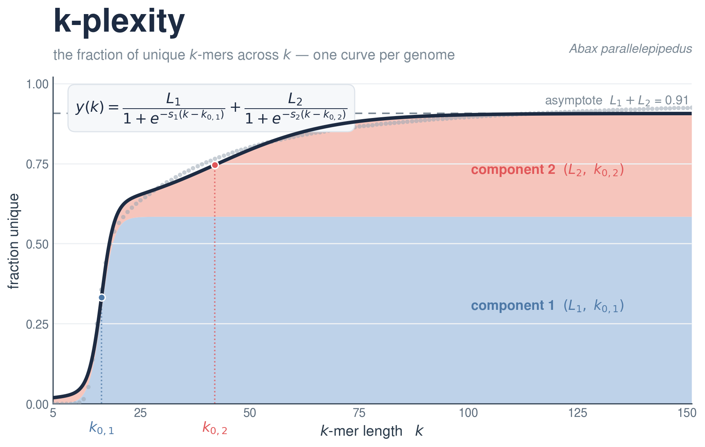
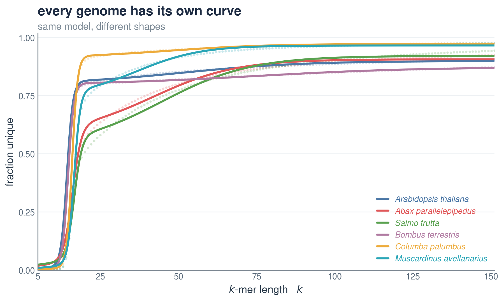

# k-plexity

**How repetitive is a genome? Slide a window of length *k* along it and ask: what fraction
of *k*-mers are unique? Plot that fraction across *k* — that's the k-plexity curve.** 🧬

One curve per genome, straight from the assembly — no reads, no annotation, seconds to compute.



Every curve is summarised by a simple **double sigmoid** — just six numbers
(`L1, L2, s1, s2, k0_1, k0_2`) that describe its shape.

▶ *New here?* [Watch the 40-second explainer.](animation/kplex_story.gif)

---

## Install

```bash
git clone --recursive https://github.com/jacgonisa/kplexity.git
cd kplexity
pip install -e .
```

That gives you the **`kplex`** command. The *k*-mer counting is done by a small separate
binary — build the bundled one once and point `kplex` at it:

```bash
make -C FASTK Kplex
export KPLEX_BIN=$PWD/FASTK/Kplex
#   (or use KMC instead:  conda install -c bioconda kmc  →  --tool kmc)
```

---

## Three commands

```bash
kplex run   genome.fa    #  FASTA  → curve        (.kplex.csv)
kplex fit   curve.csv    #  curve  → parameters   (.fit.json)
kplex plot  curve.csv    #  curve  → figure       (.png)
```

…or all three at once:

```bash
kplex run genome.fa -o mygenome --chromosomes-only --fit --plot -T 20
#  → mygenome.kplex.csv, mygenome.fit.json, mygenome.png
```

Handy flags: `-k 5:151:1` (k range), `-T` (threads), `--chromosomes-only`
(keep chromosome-scale sequences), `--tool fastk|kmc`.

---

## The curve, in one equation

```
y(k) = L1 / (1 + e^(−s1·(k − k0_1)))  +  L2 / (1 + e^(−s2·(k − k0_2)))
```

Two sigmoids add up to the curve. The six parameters are just its shape:

| parameter | what it is |
|---|---|
| `L1`, `L2` | heights of the two components (their sum `L1 + L2` is the plateau) |
| `k0_1`, `k0_2` | the two midpoints — where each component rises |
| `s1`, `s2` | how steeply each one rises |
| **asymptote** = `L1 + L2` | the high-*k* plateau (overall uniqueness) |

`kplex fit` writes these to a `.fit.json` and reports `R²`, `RMSE` and `AICc`.
*(The tool stays agnostic about what the shape means biologically.)*

---

## Every genome has its own curve



---

## How `fraction_unique` is computed

For each *k*, every length-*k* window along the genome is one *k*-mer:

```
fraction_unique  =  U / T
   U = number of distinct k-mers
   T = total k-mers  (one per position, ≈ genome length)
```

A non-repetitive stretch has `U = T` (every *k*-mer different → 1); repeats make the same
*k*-mers recur, so `U < T` and the fraction drops. Sweep *k* from 5 → 151 and you trace the curve.

---

## Layout

```
kplex/        the CLI (run / fit / plot)
FASTK/        the k-mer counter  (git submodule → jacgonisa/FASTK)
assets/       figures
animation/    the explainer
```

**Contact:** Jacob Gonzalez · [github.com/jacgonisa](https://github.com/jacgonisa)
