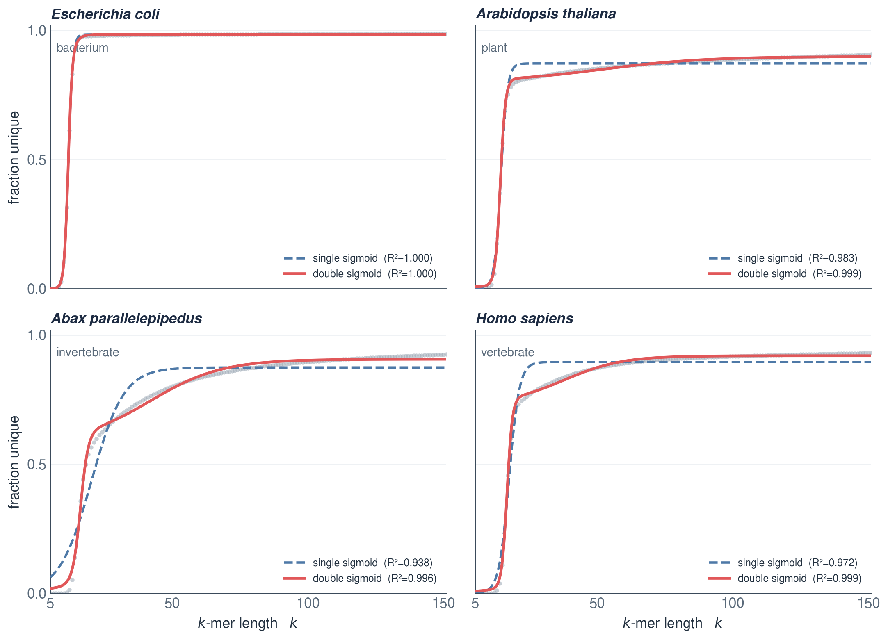

# k-plexity

**k-plexity is the fraction of unique *k*-mers in a genome assembly, as a function of *k*.**

For each *k*, `kplex` counts the distinct *k*-mers in the assembly (`U`) and the total number of
*k*-mers (`T`); the curve is `U/T` over *k* = 5–151. It uses the assembly only — no reads, no
annotation — and is summarised by a double-sigmoid fit (six parameters).


Bacteria are well described by a single sigmoid; eukaryotes, with their repeat content, need the
second component — the double sigmoid:



---

## Install

```bash
git clone --recursive https://github.com/jacgonisa/kplexity.git
cd kplexity
pip install -e .
```

That gives you the **`kplex`** command. The *k*-mer counting is done by a small separate
binary — build the bundled one once and point `kplex` at it:

```bash
make -C FASTK Kplex
export KPLEX_BIN=$PWD/FASTK/Kplex
#   (or use KMC instead:  conda install -c bioconda kmc  →  --tool kmc)
```

---

## Three commands

```bash
kplex run   genome.fa    #  FASTA  → curve        (.kplex.csv)
kplex fit   curve.csv    #  curve  → parameters   (.fit.json)
kplex plot  curve.csv    #  curve  → figure       (.png)
```

…or all three at once:

```bash
kplex run genome.fa -o mygenome --chromosomes-only --fit --plot -T 20
#  → mygenome.kplex.csv, mygenome.fit.json, mygenome.png
```

Handy flags: `-k 5:151:1` (k range), `-T` (threads), `--chromosomes-only`
(keep chromosome-scale sequences), `--tool fastk|kmc`.

---

## The double-sigmoid fit

```
y(k) = L1 / (1 + e^(−s1·(k − k0_1)))  +  L2 / (1 + e^(−s2·(k − k0_2)))
```

Two sigmoids add up to the curve. The six parameters are just its shape:

| parameter | what it is |
|---|---|
| `L1`, `L2` | heights of the two components (their sum `L1 + L2` is the plateau) |
| `k0_1`, `k0_2` | the two midpoints — where each component rises |
| `s1`, `s2` | how steeply each one rises |
| **asymptote** = `L1 + L2` | the high-*k* plateau (overall uniqueness) |

`kplex fit` writes these to a `.fit.json` and reports `R²`, `RMSE` and `AICc`.

---

## Acknowledgements

- The original idea for k-plexity is **Katie Jenike's**.
- The core *k*-mer counting is done by **[FASTK](https://github.com/thegenemyers/FASTK)**
  (Gene Myers); `kplex` wraps `FASTK`/`Kplex` (bundled here as a submodule).
- **Claude** was used in this project (mainly in the k-plexity animation, benchmarking automatization and in
  the `kplex` command-line interface). The core counting code comes from **FASTK**.

---

## Layout

```
kplex/        the CLI (run / fit / plot)
FASTK/        the k-mer counter  (git submodule → jacgonisa/FASTK; wraps FASTK by Gene Myers)
assets/       figures
animation/    the explainer
```

**Contact:** Jacob Gonzalez · [github.com/jacgonisa](https://github.com/jacgonisa)
